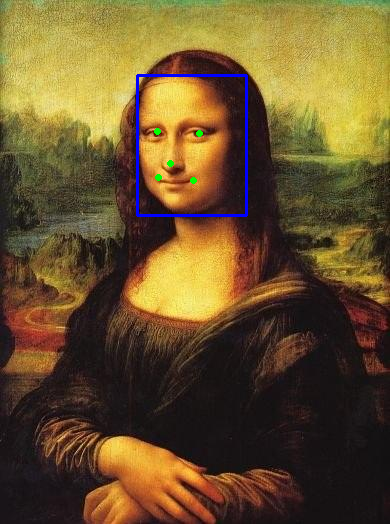

# 人脸检测

这是人脸检测接口的示例展示，其中输入为静态图片，检测结果显示在终端。想要了解项目级示例的，可参考 ESP-WHO/examples/human_face_detection，其中输入图片来自摄像头，结果显示在 LCD 屏上。

文件结构如下：

```shell
human_face_detect/
├── CMakeLists.txt
├── image.jpg
├── main
│   ├── app_main.cpp
│   ├── CMakeLists.txt
│   └── image.hpp
├── partitions.csv
├── README.md
└── result.png
```


## 运行示例

1. 打开终端，进入当前示例（ESP-DL/examples/human_face_detect）

2. 设定目标芯片。例如，目标芯片是 ESP32

   ```shell
   idf.py set-target esp32
   ```

3. 烧写和监视，得到检测结果如下

   ```shell
   idf.py flash monitor
   
   ... ...
   
   [0] score: 0.987580, box: [137, 75, 246, 215]
       left eye: (157, 131), right eye: (158, 177)
       nose: (170, 163)
       mouth left: (199, 133), mouth right: (193, 180)
   ```

4. 在 PC 上显示图片结果。我们提供了显示工具 `display_image.py`，方便用户体验更直观的检测结果。显示工具存放在 [example/tool/](../tool/) 中，请根据介绍使用工具。当前示例的显示结果如下图。

   
   


## 其他设置

在 [./main/app_main.cpp](./main/app_main.cpp) 的开头处，有一个名为 `TWO_STAGE` 的宏定义。正如注释所述，

- `TWO_STAGE` = 1: 检测器为 two-stage，检测结果更加精确（支持人脸关键点），但速度比较慢。
- `TWO_STAGE` = 0: 检测器为 one-stage，检测结果相对稍差（不支持人脸关键点），但速度比较快。

用户可自行体验两者差异。


## 自定义输入图片

示例中 [./main/image.hpp](./main/image.hpp) 是预设的输入图片。我们提供了转换工具 `convert_to_u8.py` ，方便用户将自己的图片转换成 C/C++ 的形式。转换工具存放在 [examples/tool/](../tool/) 中，请根据介绍使用工具。

1. 在本示例中，使用 [examples/tool/convert_to_u8.py](../tool/convert_to_u8.py) 转化图片，如下：

   ```shell
   # 假设当前仍在目录 human_face_detect 下
   python ../tool/convert_to_u8.py -i ./image.jpg -o ./main/image.hpp
   ```

2. 参考 [Run Example](#Run-Example) 中的步骤，烧写程序，获取并显示检测结果。

